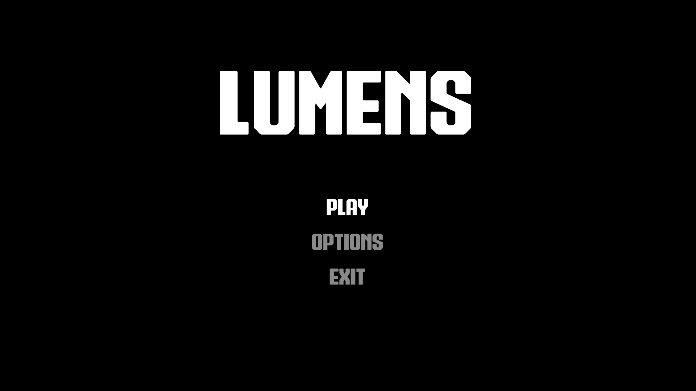
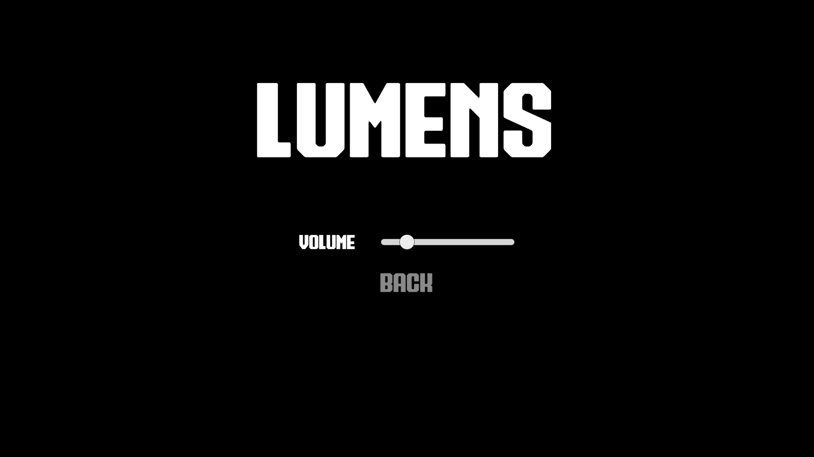
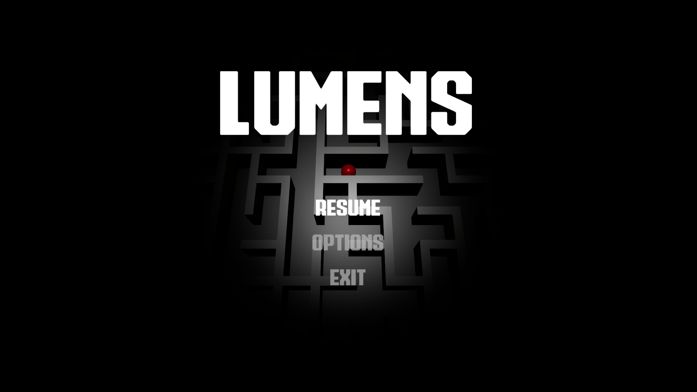

# **Lumens**

Lumens is a Unity-based 3D maze game in which the player rolls a ball through a dynamically generated maze toward the exit.

Download the latest build [**here**](https://github.com/3-vivek-3/Lumens/releases/tag/v1.0.0).

## **Project Organization**

Inside `Assets/`, the key folders for this game are:

* **Scripts**

  C# scripts for managers, gameplay, menus, and scene transitions.

* **Scenes**

  Scenes for startup, the main menu, and gameplay.

* **Prefabs**

  Reusable objects such as:
  * Ball
  * Maze walls
  * Floor
  * Exit wall
  * Spotlight
  * Menu UIs

* **Input**
  
  Unity Input System action maps and their generated C# wrapper classes.

* **Audio**
  
  Background audio, looped and used in both the main menu and gameplay.

## **Scene Flow**

```
Start → Menu → Gameplay → Game Over
```

### **Scene Database**

* Scene names are centralized in `SceneDatabase.cs`.
* This avoids hardcoded strings and makes scene transitions easier to maintain.

### **Bootstrap Scene**

`BootstrapScene.unity` contains a `GlobalManager` game object with persistent systems that survive scene loads:

* **GlobalManager**
  
  Orchestrates scene transitions, loading overlays, input changes, and audio fades.

* **SceneController**
  
  Handles additive scene loading and unloading using a transition plan.

* **MenuManager**
  
  Manages opening and closing stacked UI menus.

* **AudioManager**
  
  Plays and fades background music.

* **InputManager**
  
  Handles input action maps and routes input events.

* **LoadingOverlay**
  
  Handles fade-in and fade-out during scene changes.

### **Menu Scene**

`MenuScene.unity` includes:

* `MainMenu` prefab
* Other stacked menu prefabs (Options, etc.)

### **Gameplay Scene**

Key components:

* **GameplayManager**

  * Generates the maze
  * Spawns the ball
  * Handles pause, resume, and game-over logic

* **MazeManager**

  * Procedural maze generation using Wilson’s algorithm

* **GameplayPauseMenu**

  * Resume
  * Options
  * Exit to menu

## **Core Systems**

### **Game Planning & Structure**

The game uses a manager-based architecture:

* **Global systems**

  * Created once in the bootstrap scene
  * Persist across all scene loads

* **Gameplay systems**

  * Exist only in the gameplay scene
  * Rebuilt every time gameplay starts

This keeps the project clean and scalable. New scenes (tutorial, credits, etc.) can be added without rewriting core systems.

### **Input (Player Controls)**

The game uses the Unity Input System with two action maps:

* **Gameplay**

  * Move
  * Pause

* **UI**

  * Resume
  * Back

The `InputManager` listens to input events and broadcasts them using C# events.

### **Player Movement (Rolling the Ball)**

* The `PlayerController` applies torque to the ball’s `Rigidbody` based on input direction.
* This produces natural rolling movement.

`Ball` prefab includes:

* `Rigidbody`
* `SphereCollider`
* `PlayerController`

### **Maze Generation (Procedural Level)**

The `MazeManager`:

1. Constructs a grid of nodes and edges
2. Uses Wilson’s algorithm to carve paths
3. Instantiates:

   * `Wall` prefab for edges that remain walls
   * `Floor` prefab, scaled to maze size
   * `ExitWall` prefab at the far edge

### **Game Over Condition (Exit Wall Trigger)**

* The `ExitWall` prefab has a trigger collider.
* When the ball (tagged `"Ball"`) enters:

  * `GameOver()` is triggered
  * The game returns to the main menu

### **Camera & Spotlight Following**

The `GameplayManager` controls:

* A camera that follows the ball from above/behind
* A spotlight positioned directly above the ball

### **UI Menus (Main, Options, Pause)**

All UI menus inherit from a base `Menu` class, which:

* Enables/disables a root UI game object
* Tracks the first selected button for navigation

* **MainMenu**

  * Play
  * Options
  * Exit

* **OptionsMenu**

  * Volume slider

* **GameplayPauseMenu**

  * Resume
  * Options
  * Exit

The `MenuManager` uses a stack-based system to support nested menus and back navigation.

### **Audio System**

The `AudioManager`:

* Plays a looping background track
* Handles fade-in and fade-out
* Saves volume settings using `PlayerPrefs`

## Images





## References

* Wilson's algorithm for uniform maze generation: https://en.wikipedia.org/wiki/Maze_generation_algorithm
* Scene controller using builder pattern: https://youtu.be/oejg12YyYyI?si=vYVXBV0uJN2L_fBS

